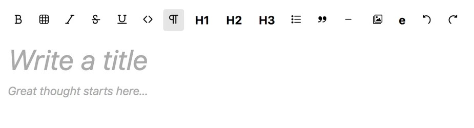

# TipTap title plugin

Makes the first line of an editor to be a title

Example
---

Usage
---
```js
export default {
  data() {
    return {
      editor: new Editor({
        extensions: [
          new Title({
            emptyClass: 'article-empty-title',
            placeholder: 'Write a title',
            paragraphPlaceholder: 'Great thoughts starts here...',
            headingClass: 'article-header'
          }),
        ]
      })
    }
  }
}
```